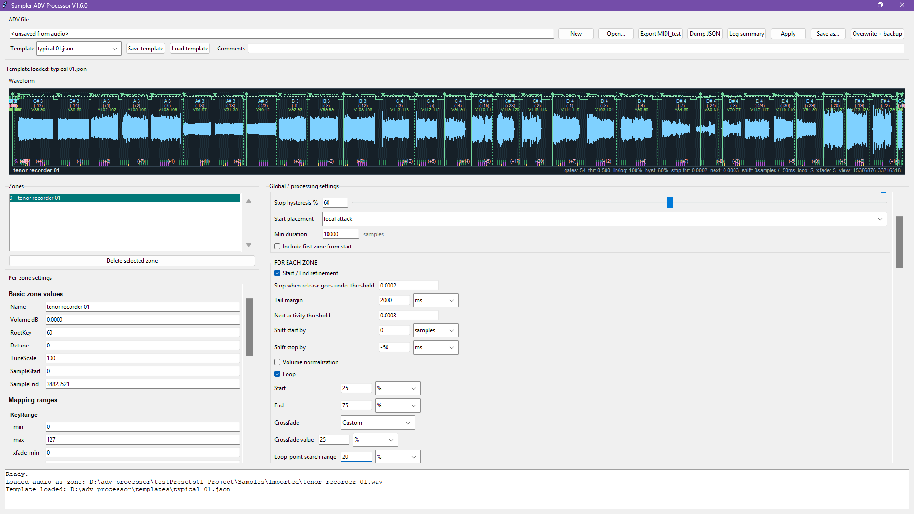

# Sampler ADV Processor

Desktop tool for inspecting and batch-editing Ableton Sampler `.adv` presets.

It is mainly aimed at workflows like:
- splitting long recordings into zones
- refining sample start/end points
- detecting pitch / detune / loop points
- remapping key, velocity, and chain ranges
- editing many Sampler parameters faster than in Live



## Requirements

- Python (tested on 3.10, Windows)
- Ableton Sampler `.adv` presets (tested on 12.3.2 presets)

Python libraries used by the tool:
- `numpy`
- `soundfile`
- `scipy`
- `tkinter`
- `tkinterdnd2`

## Installation

Install python, type this in windows command prompt:

```powershell
python -m pip install --upgrade pip
python -m pip install numpy soundfile scipy tkinterdnd2
```

If `soundfile` gives you trouble, updating `pip` first usually helps.

## Running

From the project folder, run:

```powershell
python sampler_adv_processor.py
```

## Basic Usage

Typical workflow:

1. Open an existing `.adv` preset, or drop an audio file to start a new one.
2. Load a template if you use template-based defaults.
3. Enable only the processing blocks you want.
4. Click `Apply`.
5. Save with `Save as...`

Templates are stored as `.json` files in the `templates` folder.

## Audio Files

Supported audio extensions currently include:

- `.wav`
- `.aif`
- `.aiff`
- `.flac`
- `.ogg`
- `.mp3`
- `.m4a`
- `.caf`

## Tests

There is an automated test file included:

```powershell
python -m unittest -q test_sampler_adv_processor.py
```
